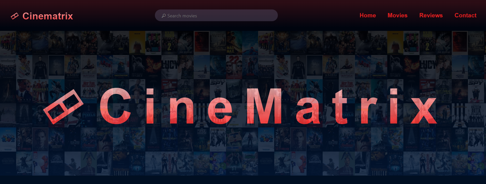

# Cinematrix (HTML | CSS | JS)
Cinematrix is a web application that displays movie posters using data fetched from the TMDB (The Movie Database) API. It allows users to search for movies by name and view the corresponding movie posters.

### Features
- Display a grid of movie posters.
- Display movie details by hovering on a poster
- Display movie overview by clicking on expand arrow
- Search for movies by name and view the search results as movie posters.

### Live Demo
Checkout the live demo <a href="https://ayuxi03.github.io/Movie-matrix/">here.</a>

### Usage
- Open the application in a web browser.
- Use the search bar at the top to search for movies by name.
- The application will display the movie posters of the search results.

### Technologies Used
- HTML
- CSS
- JavaScript
- TMDB API

#### Contributions are welcome! Please open an issue or submit a pull request for any changes. (Note: Still under development)

#### Created By: [Ayushi Moitra](https://github.com/ayuxi03) 
